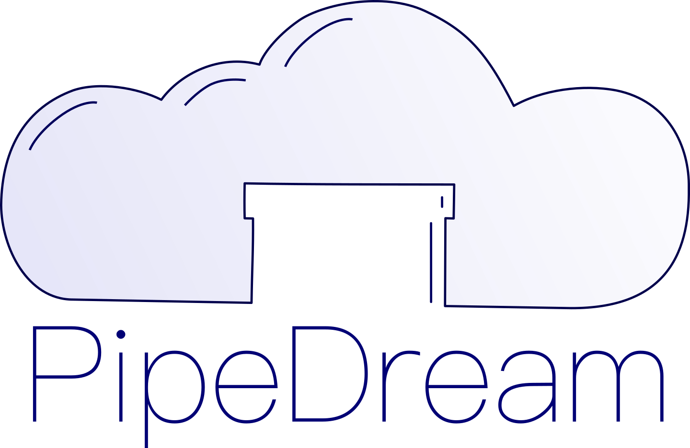

<p align="center">
    
    <p align="center">Maintainable automation.</p>
</p>

[](https://github.com/Layer9Berlin/PipeDream/releases/latest)
[](/LICENSE.txt)
[](https://github.com/Layer9Berlin/pipedream/actions?query=workflow%3A%22PipeDream+release%22)
[](https://codecov.io/gh/Layer9Berlin/PipeDream)
[](http://godoc.org/github.com/Layer9Berlin/pipedream)
[](https://conventionalcommits.org)

>## 🚧 Status: alpha 🚧
>#### Early development
> Please expect breaking changes. Feel free to file an issue if you
> - find a bug
> - need a feature added or tweaked for your use case
> - have any other suggestions

PipeDream is an open-source, general-purpose **automation tool**.

It is an alternative to shell scripts - just as powerful, but more **portable**, **composable**, **testable** and **reliable**.

## How it works

Define a pipeline in a yaml file. Using a simple, but extensible syntax, you can call, chain, merge, and split pipelines, invoke shell commands, handle errors, write tests, create mocks, and much more.

## Getting started

Have a look at the [Quick Start Guide](./docs/quick-start), the [Documentation](./cmd) or just run the program. It will offer to create a sample pipeline file in your current folder.

## Installation

### From `npm`

```
npm i -g @l9/pipedream
```

### Using `homebrew` (Mac OS/linux)

```
brew install layer9berlin/tap/pipedream
```

### From source (requires Go installed)

```
git clone https://github.com/Layer9Berlin/PipeDream
cd PipeDream
go build
pipedream
```
then select `Install` when promted.

This will compile PipeDream and run it locally, allowing you to execute the `install.pipe` file (very meta), which in turn installs everything you need to run PipeDream anywhere on your machine. If you make changes to the code, just run PipeDream and execute the `installation.pipe` again to update your installed version. You can skip the installation step entirely if you only want to run PipeDream in the project folder and don't need any of the utility tools.

If you use PipeDream a lot, it might be convenient to set up an alias like `p` that is faster to type.

## Uninstall

### Installed via `npm`

```
npm uninstall -g @l9/pipedream
```

### Installed via `homebrew`

```
brew uninstall pipedream
```

### Compiled from source

Simply run

```
pipedream
```

in the repo source directory and select `Uninstall`.

### Not sure

If you don't recall how you installed PipeDream, run

```
pipedream version
```

and check the `via` field.

## Why wouldn't I just use a shell script?

Shell scripting is an art that takes years to master. Tools like [shellcheck](https://github.com/koalaman/shellcheck) and [bats](https://github.com/bats-core/bats-core) can help you improve the code quality of your scripts, but they don't solve the core problems:
- There are many traps for beginners to fall into
- Each command has its own syntax (not to mention subtle differences between shells)
- Error handling is so difficult it's rarely done well
- Even simple tasks often require contorted solutions that break for edge cases
- A lack of tests and documentation means you generally don't want to adapt an existing script

If you have used a modern CI/CD, orchestration or containerization tool, you are probably already familiar with a different way to write a script: defining tasks in yaml format. PipeDream is the natural extension of these tools to your localhost. Automate anything, anywhere, using a simple syntax that follows the principle of least astonishment.

> _"It's like Ansible for localhost!"_
>
> Anonymous

We have created PipeDream to simplify maintenance and dependency management tasks that used to involve a large number of steps, combining many different tools running both locally and on remote servers.

To illustrate its potential, we have used PipeDream to define a **universal dependency manager** pipe. It offers a single, consistent interface pulling together results from different package managers.
